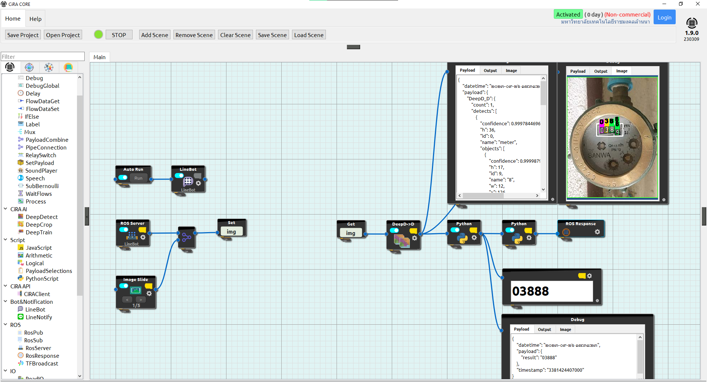

# TEACH-RMUTL_CiRACORE_300923
ไฟล์นี้เป็นส่วนนึกในการสอน "การใช้งานโปรแกรม CiRA CORE เบิ้องต้น" จากประสบการณ์ของผู้ทดลองใช้งาน เพื่อเป็นแนวทางในการศึกษาและพัฒนาต่อไป

คณะผู้จัดทำนายภาณุพงศ์ ทองวิลาศ, นายภูริภัทร์ จิรพรสวัสดิ์ และ ผู้ช่วยศาสตราจารย์ขวัญชัย เอื้อวิริยานุกูล

แนะนำการใช้งานโปรแกรม CiRA CORE เบื้องต้น:
[Slide](https://livermutlac-my.sharepoint.com/:b:/g/personal/puriphat_ji64_live_rmutl_ac_th/EbDeQB5WqcdFs1HRoZ5EzYsBJRSnyDCgxMQamCrRb4JAwQ?e=YevyyD)

Setup สำหรับ Linebot:
[Setup linebot](https://livermutlac-my.sharepoint.com/:b:/g/personal/puriphat_ji64_live_rmutl_ac_th/Ec9CfmnkkcRHi7bASIF-DS4B7uoldH7YTZf4e4-oE67Lzw?e=iExzEY) | [Download pdf](https://github.com/redsoul2032/TEACH-RMUTL_CiRACORE_300923/files/12735796/01-setup.linebot.ciracore.pdf)
# ภาพรวม

